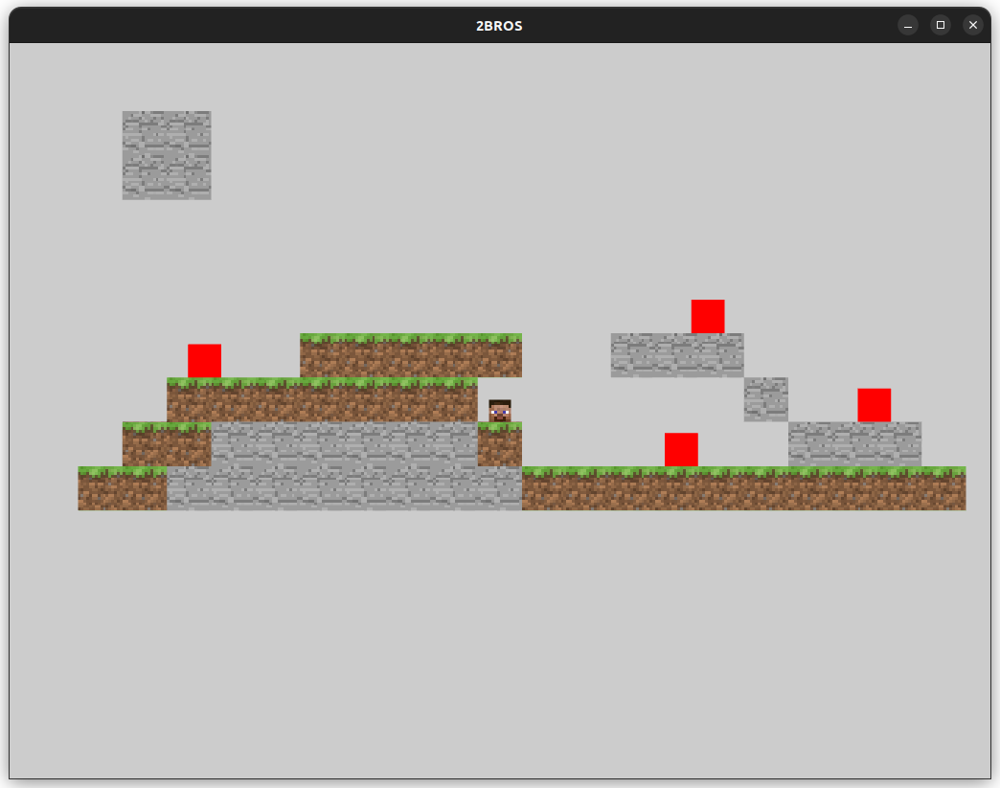

# Moteur de jeux

## Contexte
Ce projet a été réalisé dans le cadre de la matière Moteur de Jeu dans le master informatique IMAGINE de la faculté des sciences de Montpellier.
Le but de ce moteur de jeux est de pouvoir 

Encadrant:
- Noura FARAJ

Etudiants:
- Laëtitia LAPORTE
- Pierre RICHARD

Date: 2 avril 2024 - 15 Mai 2024

## Installation
```shell
mkdir build
cd build
cmake ..
make
bash launch-Moteur.sh
```
## Présentation 

Fonctionnalités implémentés:
- collision
- detection du joueur
- destruction de l'environnement
- interprétation d'une carte (fichier texte)